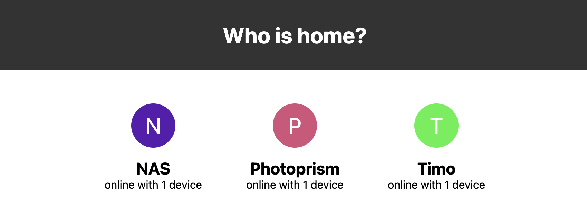

fritzbox-based-presence
===
[](https://github.com/timo-reymann/fritzbox-based-presence/blob/main/LICENSE)
[](https://hub.docker.com/r/timoreymann/fritzbox-based-presence)
[](https://goreportcard.com/report/github.com/timo-reymann/fritzbox-based-presence)
[](https://codecov.io/gh/timo-reymann/fritzbox-based-presence)
[](https://app.circleci.com/pipelines/github/timo-reymann/fritzbox-based-presence)
[](https://github.com/timo-reymann/fritzbox-based-presence/releases)
[![Renovate](https://img.shields.io/badge/renovate-enabled-green?logo=data:image/svg+xml;base64,PHN2ZyB4bWxucz0iaHR0cDovL3d3dy53My5vcmcvMjAwMC9zdmciIHZpZXdCb3g9IjAgMCAzNjkgMzY5Ij48Y2lyY2xlIGN4PSIxODkuOSIgY3k9IjE5MC4yIiByPSIxODQuNSIgZmlsbD0iI2ZmZTQyZSIgdHJhbnNmb3JtPSJ0cmFuc2xhdGUoLTUgLTYpIi8+PHBhdGggZmlsbD0iIzhiYjViNSIgZD0iTTI1MSAyNTZsLTM4LTM4YTE3IDE3IDAgMDEwLTI0bDU2LTU2YzItMiAyLTYgMC03bC0yMC0yMWE1IDUgMCAwMC03IDBsLTEzIDEyLTktOCAxMy0xM2ExNyAxNyAwIDAxMjQgMGwyMSAyMWM3IDcgNyAxNyAwIDI0bC01NiA1N2E1IDUgMCAwMDAgN2wzOCAzOHoiLz48cGF0aCBmaWxsPSIjZDk1NjEyIiBkPSJNMzAwIDI4OGwtOCA4Yy00IDQtMTEgNC0xNiAwbC00Ni00NmMtNS01LTUtMTIgMC0xNmw4LThjNC00IDExLTQgMTUgMGw0NyA0N2M0IDQgNCAxMSAwIDE1eiIvPjxwYXRoIGZpbGw9IiMyNGJmYmUiIGQ9Ik04MSAxODVsMTgtMTggMTggMTgtMTggMTh6Ii8+PHBhdGggZmlsbD0iIzI1YzRjMyIgZD0iTTIyMCAxMDBsMjMgMjNjNCA0IDQgMTEgMCAxNkwxNDIgMjQwYy00IDQtMTEgNC0xNSAwbC0yNC0yNGMtNC00LTQtMTEgMC0xNWwxMDEtMTAxYzUtNSAxMi01IDE2IDB6Ii8+PHBhdGggZmlsbD0iIzFkZGVkZCIgZD0iTTk5IDE2N2wxOC0xOCAxOCAxOC0xOCAxOHoiLz48cGF0aCBmaWxsPSIjMDBhZmIzIiBkPSJNMjMwIDExMGwxMyAxM2M0IDQgNCAxMSAwIDE2TDE0MiAyNDBjLTQgNC0xMSA0LTE1IDBsLTEzLTEzYzQgNCAxMSA0IDE1IDBsMTAxLTEwMWM1LTUgNS0xMSAwLTE2eiIvPjxwYXRoIGZpbGw9IiMyNGJmYmUiIGQ9Ik0xMTYgMTQ5bDE4LTE4IDE4IDE4LTE4IDE4eiIvPjxwYXRoIGZpbGw9IiMxZGRlZGQiIGQ9Ik0xMzQgMTMxbDE4LTE4IDE4IDE4LTE4IDE4eiIvPjxwYXRoIGZpbGw9IiMxYmNmY2UiIGQ9Ik0xNTIgMTEzbDE4LTE4IDE4IDE4LTE4IDE4eiIvPjxwYXRoIGZpbGw9IiMyNGJmYmUiIGQ9Ik0xNzAgOTVsMTgtMTggMTggMTgtMTggMTh6Ii8+PHBhdGggZmlsbD0iIzFiY2ZjZSIgZD0iTTYzIDE2N2wxOC0xOCAxOCAxOC0xOCAxOHpNOTggMTMxbDE4LTE4IDE4IDE4LTE4IDE4eiIvPjxwYXRoIGZpbGw9IiMzNGVkZWIiIGQ9Ik0xMzQgOTVsMTgtMTggMTggMTgtMTggMTh6Ii8+PHBhdGggZmlsbD0iIzFiY2ZjZSIgZD0iTTE1MyA3OGwxOC0xOCAxOCAxOC0xOCAxOHoiLz48cGF0aCBmaWxsPSIjMzRlZGViIiBkPSJNODAgMTEzbDE4LTE3IDE4IDE3LTE4IDE4ek0xMzUgNjBsMTgtMTggMTggMTgtMTggMTh6Ii8+PHBhdGggZmlsbD0iIzk4ZWRlYiIgZD0iTTI3IDEzMWwxOC0xOCAxOCAxOC0xOCAxOHoiLz48cGF0aCBmaWxsPSIjYjUzZTAyIiBkPSJNMjg1IDI1OGw3IDdjNCA0IDQgMTEgMCAxNWwtOCA4Yy00IDQtMTEgNC0xNiAwbC02LTdjNCA1IDExIDUgMTUgMGw4LTdjNC01IDQtMTIgMC0xNnoiLz48cGF0aCBmaWxsPSIjOThlZGViIiBkPSJNODEgNzhsMTgtMTggMTggMTgtMTggMTh6Ii8+PHBhdGggZmlsbD0iIzAwYTNhMiIgZD0iTTIzNSAxMTVsOCA4YzQgNCA0IDExIDAgMTZMMTQyIDI0MGMtNCA0LTExIDQtMTUgMGwtOS05YzUgNSAxMiA1IDE2IDBsMTAxLTEwMWM0LTQgNC0xMSAwLTE1eiIvPjxwYXRoIGZpbGw9IiMzOWQ5ZDgiIGQ9Ik0yMjggMTA4bC04LThjLTQtNS0xMS01LTE2IDBMMTAzIDIwMWMtNCA0LTQgMTEgMCAxNWw4IDhjLTQtNC00LTExIDAtMTVsMTAxLTEwMWM1LTQgMTItNCAxNiAweiIvPjxwYXRoIGZpbGw9IiNhMzM5MDQiIGQ9Ik0yOTEgMjY0bDggOGM0IDQgNCAxMSAwIDE2bC04IDdjLTQgNS0xMSA1LTE1IDBsLTktOGM1IDUgMTIgNSAxNiAwbDgtOGM0LTQgNC0xMSAwLTE1eiIvPjxwYXRoIGZpbGw9IiNlYjZlMmQiIGQ9Ik0yNjAgMjMzbC00LTRjLTYtNi0xNy02LTIzIDAtNyA3LTcgMTcgMCAyNGw0IDRjLTQtNS00LTExIDAtMTZsOC04YzQtNCAxMS00IDE1IDB6Ii8+PHBhdGggZmlsbD0iIzEzYWNiZCIgZD0iTTEzNCAyNDhjLTQgMC04LTItMTEtNWwtMjMtMjNhMTYgMTYgMCAwMTAtMjNMMjAxIDk2YTE2IDE2IDAgMDEyMiAwbDI0IDI0YzYgNiA2IDE2IDAgMjJMMTQ2IDI0M2MtMyAzLTcgNS0xMiA1em03OC0xNDdsLTQgMi0xMDEgMTAxYTYgNiAwIDAwMCA5bDIzIDIzYTYgNiAwIDAwOSAwbDEwMS0xMDFhNiA2IDAgMDAwLTlsLTI0LTIzLTQtMnoiLz48cGF0aCBmaWxsPSIjYmY0NDA0IiBkPSJNMjg0IDMwNGMtNCAwLTgtMS0xMS00bC00Ny00N2MtNi02LTYtMTYgMC0yMmw4LThjNi02IDE2LTYgMjIgMGw0NyA0NmM2IDcgNiAxNyAwIDIzbC04IDhjLTMgMy03IDQtMTEgNHptLTM5LTc2Yy0xIDAtMyAwLTQgMmwtOCA3Yy0yIDMtMiA3IDAgOWw0NyA0N2E2IDYgMCAwMDkgMGw3LThjMy0yIDMtNiAwLTlsLTQ2LTQ2Yy0yLTItMy0yLTUtMnoiLz48L3N2Zz4=)](https://renovatebot.com)
[](https://pre-commit.com/)
[](https://sonarcloud.io/summary/new_code?id=timo-reymann_fritzbox-based-presence)
[](https://sonarcloud.io/summary/new_code?id=timo-reymann_fritzbox-based-presence)
[](https://sonarcloud.io/summary/new_code?id=timo-reymann_fritzbox-based-presence)

<p align="center">
	
    <br />
    Show who is home based on devices connected to FritzBox that are currently online.
</p>

## Features

- show who is currently connected to your home network and online
- single go binary
- docker images for all popular platforms

## Requirements

- Fritz!OS 7.57+ (they changed the data format inbetween)

## Installation

- Download [latest release](https://github.com/timo-reymann/fritzbox-based-presence/releases/latest) and spin up the
  binary as systemd service, screen etc.
- OR use the prebuilt docker images (see [Usage](#usage) for an full example)

## Usage

- Create a dedicated Fritz!Box user
    - Navigate to [fritz.box](http://fritz.box) in your browser
    - Login
    - Create a user under `System > Fritz!Box Users`
      
    - Create a docker-compose file with the following contents:
      ```yaml
      version: "3.5"
      services:
        fritzbox-presence:
          image: timoreymann/fritzbox-based-presence:latest # check for version to use if you would like to pin it
          restart: always
          ports:
            - <public-port>:8090
          environment:
            FB_PRESENCE__SHOW_GUESTS: "true"
            FB_PRESENCE__FRITZ_BOX_URL: http://192.168.178.1
            FB_PRESENCE__FRITZ_BOX_USERNAME: <your-user>
            FB_PRESENCE__FRITZ_BOX_PASSWORD: <your-password>
            FB_PRESENCE__DEVICE_NAME_MAPPING: Name=device1,device2|Name2=device1
            FB_PRESENCE__AUTH_PASSWORD: <<password here>>
      ```
    - Run `docker compose up -d`
    - Open your browser at `<host IP>:<public port>`
    - Optionally add to your DynDNS, cloudflared tunnel etc. to make it available

> For all available options just run the binary without any required variable set to get an overview, or if you are
> familliar with go code check the [config sources](./pkg/config/main.go)

## Motivation

Living together can be hard. And knowing who will be home is a nice thing to have.

Manual maintenance with signs or something analog or the good old message is boring, so lets use something a bit more
reliable.

## Contributing

I love your input! I want to make contributing to this project as easy and transparent as possible, whether it's:

- Reporting a bug
- Discussing the current state of the configuration
- Submitting a fix
- Proposing new features
- Becoming a maintainer

To get started please read the [Contribution Guidelines](./CONTRIBUTING.md).

## Development

### Requirements

- [GNU make](https://www.gnu.org/software/make/)
- [Docker](https://docs.docker.com/get-docker/)
- [pre-commit](https://pre-commit.com/)
- Go 1.21

### Test

```shell
make test
```

### Build

```shell
make build
```

### Alternatives

- writing messages
- analog signs
- talking to other people (scary)